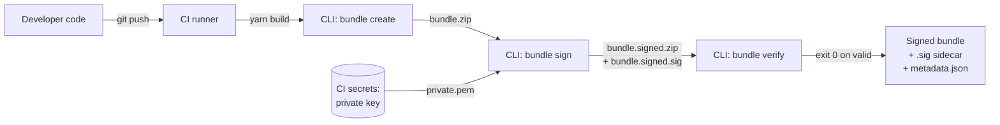
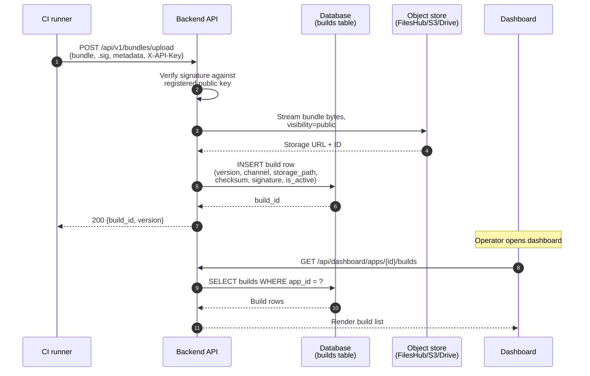
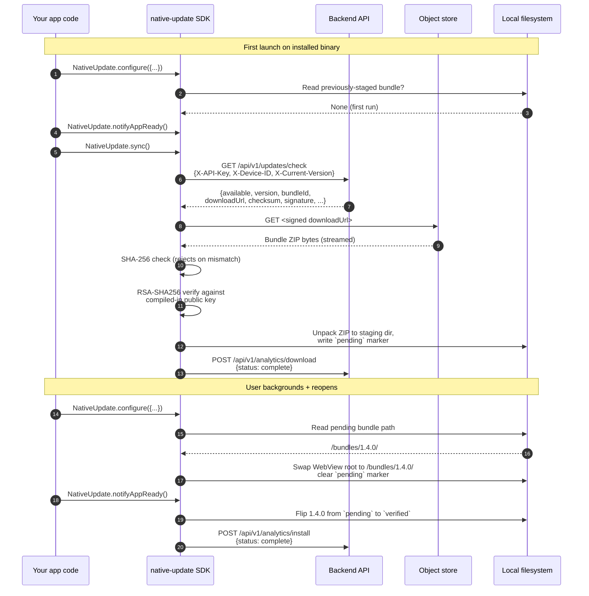
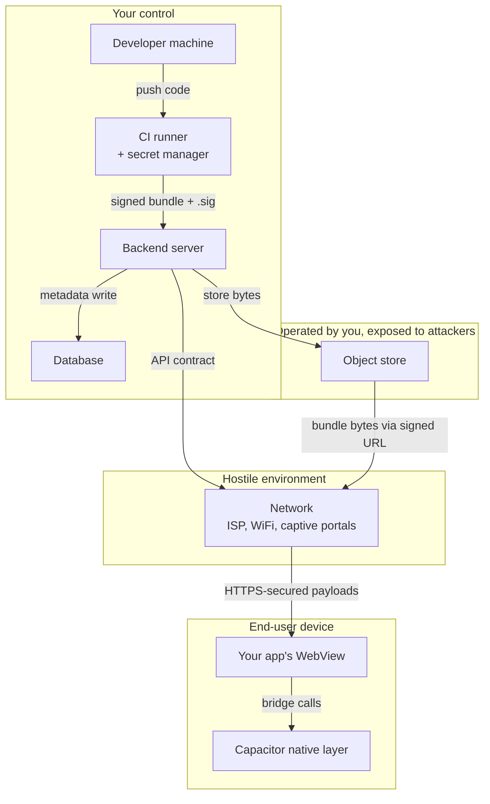

# Architecture

`native-update` is small as systems go — a CLI, an SDK, a backend, an object store — but the data flows cross a few trust boundaries and the timing of who-talks-to-whom matters for reasoning about failures. This page lays out the system in four diagrams: the build-time flow, the deploy-time flow, the runtime flow, and the trust boundaries that span all three.

The diagrams use [Mermaid](https://mermaid.js.org/) and render inline if your docs site has the plugin enabled (Docusaurus does via `@docusaurus/theme-mermaid`).

## The components

Five components participate. Each has one job; the seams between them are intentional.

The **CLI** runs on developer machines and on CI. It bundles, signs, and verifies. It never runs on a device and never talks to the backend at runtime — its work is purely a build-time prerequisite for everything else.

The **backend** is whichever of the three options you picked: the hosted SaaS, the self-hosted Laravel + Nova reference, or a custom server speaking the same contract. It owns release metadata (which bundle is current for which channel), authentication (API keys + Firebase tokens for the dashboard), and analytics writes.

The **object store** holds the raw bundle ZIPs. The hosted SaaS uses FilesHub; the self-hosted reference can use FilesHub, Google Drive, S3, R2, or local disk. The store is always behind a signed-URL gate — devices never get a permanent URL to a bundle.

The **device SDK** is the JavaScript + native code running inside your Capacitor app. It calls the backend, downloads from the object store, verifies, stages, and applies. The TypeScript layer in `src/web.ts` runs in the WebView; the Kotlin layer in `android/src/main/java/com/aoneahsan/nativeupdate/*.kt` runs on Android; the Swift layer in `ios/Plugin/*.swift` runs on iOS.

The **dashboard** is the web frontend at `website/` that human operators use to upload bundles, manage rollouts, and watch analytics. It hits the same backend as the SDK but through different endpoints (`/api/dashboard/*` instead of `/api/v1/*`) and a different auth scheme (Firebase ID tokens instead of API keys).

## Build-time flow — what happens before a bundle reaches a device

The CI run takes the developer's source, builds the static web bundle (`yarn build`), then runs three CLI steps. Bundle create makes the ZIP + metadata + SHA-256 checksum. Sign reads the private key from the CI's secret manager (it never lands in the repo) and produces the `.sig` sidecar. Verify is a defensive release gate — if the public key in the repo doesn't match the private key in secrets, verify fails and the CI aborts before publishing a broken bundle.

The artifacts that come out of this flow are three files: the signed bundle ZIP, the `.sig` sidecar, and the metadata JSON. Nothing else needs to leave CI for the deploy step to work.

## Deploy-time flow — what happens when CI publishes a bundle

The upload step verifies the signature on arrival (catching key drift before bundles reach devices), streams bytes to whatever object store the deployment is configured for, and writes the build row to the database with all the metadata the runtime check endpoint will eventually need.

Two design choices to notice. First, the object store always gets `visibility: 'public'` — the access control is enforced by the signed-URL gate at the backend, not by storage ACLs. This means a leak of the storage URL space is contained: even with a direct URL to FilesHub, an attacker without a valid signature can't authenticate. Second, the signature verification happens on upload AND on download by the device. Belt-and-braces — uploaders that somehow bypass the on-upload check still face the device-side check.

## Runtime flow — what happens when a device launches

This is the path most engineers care about. The SDK does ten things between launch and "user sees the new bundle":

The whole thing is two launches. The first launch downloads + stages. The second launch (after the user backgrounds and reopens — i.e. a process restart) applies the staged bundle. The `notifyAppReady()` on the second launch is what flips the pending bundle to verified; without it, the next launch rolls back.

The flow assumes the user-facing `updateStrategy` is `on-app-start` (the default). For `immediate`, step 9 (background + reopen) is replaced by a `NativeUpdate.reload()` call mid-session. For `on-app-resume`, step 9 is the foreground-after-background event. For `manual`, step 9 is whatever your code does.

## Trust boundaries

Every system has lines you can't cross without being a different actor. Knowing where they are makes "who can compromise what" much easier to reason about.

The boundary between "your control" and "exposed" is the storage layer. Even though FilesHub or S3 is operated by you (you pay for the account), the URLs are publicly resolvable. The mitigation is signed URLs with a short TTL and bundle-level signing — both prevent direct exploitation.

The boundary between the network and the device is HTTPS plus optional certificate pinning. Without pinning, a network operator with a valid TLS cert for your domain can MITM. With pinning ([SDK Reference → Security → Certificate Pinning](/reference/sdk/security/certificate-pinning)), the SDK refuses to talk to a server whose cert doesn't match a pinned hash — even a fully valid cert from a different CA gets rejected.

The boundary inside the device — between your WebView code and the Capacitor native layer — is the Capacitor bridge. The native layer is what calls the OS APIs (filesystem, networking, BGTaskScheduler / WorkManager); your JS layer talks to it via plugin method calls. There's no privilege escalation from JS to native beyond what the plugin exposes; that's a property of Capacitor, not specific to `native-update`.

## How the pieces version together

Two things move independently and you should know how:

The **device-side SDK version** is whatever was in the `native-update` npm package at the last app-store-release build. Updating the npm package and running `yarn build` only updates the bundle, not the SDK. The SDK only changes via app-store releases. This is why API-stable behavior matters so much: a bug-fix-only release of the SDK still requires an app-store cycle to reach devices.

The **backend version** moves whenever you redeploy (for self-hosted) or whenever the SaaS rolls out (you don't control this). The wire contract is the union of "what every SDK version expects" — backends never drop fields, only add. New fields the older SDK doesn't read are harmless; missing fields the older SDK expects break it.

The intersection rule: the backend must support the oldest SDK version still in active use on user devices. For most apps, that's app-store releases from the last 6–12 months. For enterprise apps with slower-updating user bases, it can be years. Plan accordingly when changing the wire contract — see [API Contract](/backend/api-contract).

## Where to go next

- [How OTA updates work](./how-ota-updates-work) — the lifecycle walkthrough that these diagrams animate.
- [Security model](./security-model) — the threats this architecture defends against.
- [Backend → API Contract](/backend/api-contract) — the exact wire format between SDK and backend.

## Authored by

[Ahsan Mahmood](/about-the-author) — author and maintainer of `native-update`.
