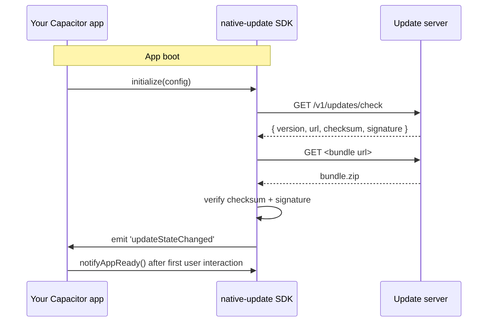

# Quick Start

This walkthrough wires the SDK end-to-end against either a local dev server or the hosted SaaS. By the end, your Capacitor app will check for updates on launch, download a bundle, verify its signature, and apply it. Allow about five minutes (most of it is `pod install` and Gradle).

:::info Prerequisites
You have completed [Installation](./installation). You have a working Capacitor 8 project that runs on at least one device or simulator.
:::

## What we are building



## Step 1 — Configure the plugin (`~30 sec`)

Add this to your app's entry file (`src/main.ts`, `src/main.tsx`, `App.vue`, or wherever you boot your app):

```typescript title="src/main.ts"
import { NativeUpdate } from 'native-update';

async function bootUpdates() {
  await NativeUpdate.initialize({
    appId: 'com.yourcompany.yourapp',          // your Capacitor appId
    serverUrl: 'https://updates.yourdomain.com', // your update server origin
    channel: 'production',                       // or 'beta', 'staging'
    autoCheck: true,
    autoUpdate: false,                           // we listen and decide ourselves
    updateStrategy: 'BACKGROUND',
    publicKey: '<your RSA / ECDSA public key PEM>',
    requireSignature: true,
    checksumAlgorithm: 'SHA-256',
    checkInterval: 3600,                         // seconds; here, hourly
    enableLogging: true,
  });
}

void bootUpdates();
```

`initialize()` is idempotent — calling it twice with the same config is safe.

:::tip No server yet?
You can point `serverUrl` at the hosted [Native Update SaaS](https://nativeupdate.aoneahsan.com) free tier, or run a local Express dev server with `npx native-update server start --port 4477` (CLI reference ships in Batch 5). To skip server setup entirely while you wire the UI, set `autoCheck: false` and call `NativeUpdate.sync()` manually with `NativeUpdate.setUpdateUrl(...)` pointing at a local file mock.
:::

## Step 2 — Notify the SDK that boot succeeded (`~30 sec`)

After your app's first meaningful render (router resolved, splash screen dismissed, etc.) tell the SDK that the current bundle is healthy. If you skip this, the SDK will roll back on the next launch — that is the deliberate "if you crashed before you said you were OK, the new bundle was probably the cause" guard.

```typescript title="src/App.tsx (or your root component)"
import { useEffect } from 'react';
import { NativeUpdate } from 'native-update';

useEffect(() => {
  NativeUpdate.notifyAppReady().catch(console.error);
}, []);
```

## Step 3 — Sync and listen (`~1 min`)

```typescript title="src/main.ts (continued)"
async function syncOnce() {
  // 1. Ask the server what's available
  const result = await NativeUpdate.sync();

  switch (result.status) {
    case 'UP_TO_DATE':
      console.log('[native-update] no update available');
      break;
    case 'UPDATE_AVAILABLE':
      console.log('[native-update] downloading', result.bundle?.version);
      break;
    case 'UPDATE_INSTALLED':
      console.log('[native-update] installed', result.bundle?.version);
      break;
    case 'ERROR':
      console.error('[native-update] sync error', result.error);
      break;
  }
}

// Listen to download progress for a UI progress bar
const progressHandle = await NativeUpdate.addListener(
  'downloadProgress',
  ({ percent, bundleId }) => {
    console.log(`[native-update] ${bundleId} → ${percent.toFixed(1)}%`);
  },
);

// Listen for the moment the bundle becomes the active one
const stateHandle = await NativeUpdate.addListener(
  'updateStateChanged',
  ({ status, version }) => {
    console.log('[native-update] state', status, version);
    if (status === 'READY') {
      // Choose your moment: prompt, restart immediately, or wait for next resume.
      // NativeUpdate.applyUpdate();  // restart now
    }
  },
);

void syncOnce();

// Don't forget to remove listeners when the app shuts down
// progressHandle.remove();
// stateHandle.remove();
```

## Step 4 — Apply the update (`~30 sec`)

You have three application strategies. Pick one based on UX preference:

| Strategy | When the new bundle takes effect | Best for |
|---|---|---|
| **`IMMEDIATE`** (call `NativeUpdate.applyUpdate()`) | Right now — app reloads | Critical fixes, off-hours pushes |
| **`ON_NEXT_RESTART`** (default if `autoUpdate: false`) | Next cold start | Most apps, most of the time |
| **`ON_NEXT_RESUME`** (set `updateStrategy: 'BACKGROUND'`) | Next time the user backgrounds and foregrounds the app | Apps with long sessions |

Configured globally via `updateStrategy` in `initialize()`, or per-call via `NativeUpdate.applyUpdate({ mode: 'IMMEDIATE' })`.

## Step 5 — Build a bundle and publish it (`~3 min`)

This step assumes you already have a built web app (`dist/`, `build/`, `www/`, etc.).

```bash
# 1. Generate a signing keypair once — keep the private key OUT of git
npx native-update keys generate --algorithm RSA --bits 2048

# 2. Build a signed bundle from your built web output
npx native-update bundle create \
  --source ./dist \
  --output ./bundles/v1.0.1.zip \
  --version 1.0.1 \
  --channel production

npx native-update bundle sign \
  --bundle ./bundles/v1.0.1.zip \
  --key ./private.pem \
  --algorithm SHA-256

# 3. Upload to your server
#    - If self-hosted Laravel + Nova: drag the .zip into the Nova "New Build" form
#    - If hosted SaaS: same flow at https://nativeupdate.aoneahsan.com/dashboard
#    - If your own backend: POST the file + signature to your /v1/bundles endpoint

# 4. (Optional) Verify the bundle locally
npx native-update bundle verify \
  --bundle ./bundles/v1.0.1.zip \
  --public-key ./public.pem
```

Detailed CLI reference ships in **Batch 5** of this docs site.

## Verify it worked

1. Bump your bundle's `version` in step 5 above (e.g. from `1.0.0` to `1.0.1`).
2. Re-launch your app.
3. You should see the download progress logs from step 3.
4. After `notifyAppReady()` fires on the new bundle, the new version is permanent.

If something does not work, check **[Common errors](#common-errors)** below before opening an issue.

---

## Common errors

| Error code | What it means | Fix |
|---|---|---|
| `NETWORK_ERROR` | Could not reach `serverUrl`. | Check `serverUrl` is reachable from the device / simulator (App Transport Security on iOS blocks plain HTTP). |
| `VERIFICATION_ERROR` | Checksum mismatch. | The bundle was modified after signing. Re-sign and re-upload. |
| `SIGNATURE_ERROR` | Public key did not verify the signature. | Confirm the public key in `initialize()` matches the private key used by `bundle sign`. |
| `QUOTA_EXCEEDED` | Local cache full. | Call `NativeUpdate.delete()` to clear old bundles. |
| `PERMISSION_DENIED` | Could not write to the app's filesystem. | Capacitor's `@capacitor/filesystem` plugin is required at runtime — it ships as a Capacitor core dep. |

Full error code reference (20+ codes, each with the exception classes that map to it) ships in **Batch 4**.

---

## What you have now

After the above, your app:

- Checks for updates on every launch (and hourly after that)
- Downloads in the background without blocking the UI
- Verifies bundles cryptographically before applying them
- Rolls back automatically if a bundle crashes before `notifyAppReady()` fires
- Emits events you can wire to a "Restart now to apply update" UI

What this Quick Start did not cover (but the full docs do):

- **Channel management** — `production` vs `staging` vs `beta` vs custom channels (How-to in Batch 8)
- **Background updates** — silent updates while the app is closed (Reference in Batch 4)
- **In-app store update prompts** — pushing users to the App Store / Play Store (Reference in Batch 3)
- **In-app review prompts** — showing the native rating sheet at the right moment (Reference in Batch 3)
- **Production backend setup** — full Laravel + Nova guide (Setup in Batch 6)

---

<div className="nu-author-card">
Built and maintained by <a href="https://aoneahsan.com">Ahsan Mahmood</a> — <a href="mailto:aoneahsan@gmail.com">aoneahsan@gmail.com</a> · <a href="https://linkedin.com/in/aoneahsan">LinkedIn</a> · <a href="https://github.com/aoneahsan">GitHub</a>.
</div>
