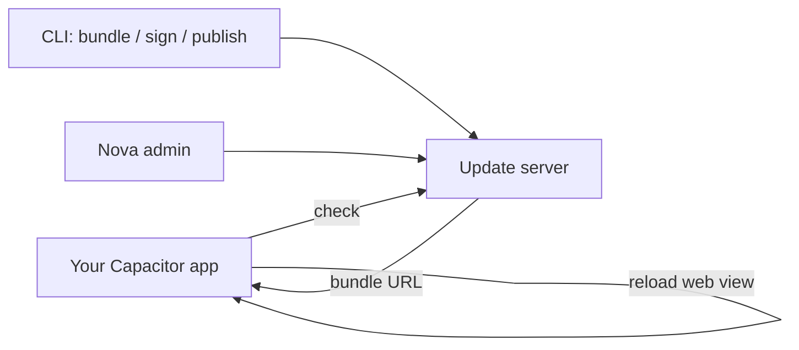

# Introduction

**`native-update` is a Capacitor plugin that ships over-the-air (OTA) JavaScript bundle updates, in-app store update prompts, and native review prompts to mobile apps — without rebuilding or resubmitting them.** It is a single SDK that wraps the four most-asked-for production update flows for hybrid mobile apps, with a reference Laravel + Nova backend you can self-host or replace with any HTTP server that follows the documented contract.

The package lives on npm at [`native-update`](https://www.npmjs.com/package/native-update), is MIT-licensed, and is built and maintained by [Ahsan Mahmood](https://aoneahsan.com).

## What it does

| Capability | What it replaces | One-line summary |
|---|---|---|
| **Live OTA updates** | CodePush / EAS Update / cap-go.com | Push JS + asset bundles to installed apps; channels, signing, and rollback included. |
| **In-app store updates** | Hand-rolled version checks against `itunes.apple.com` and `play.google.com` | Wraps Google Play In-App Updates and the iOS App Store version check behind one API. |
| **App review prompts** | Hand-rolled `SKStoreReviewController` + Play Core wrappers | Triggers the native review sheet at the right moment with safe-by-default throttling. |
| **Background updates** | Hand-rolled WorkManager + BGTaskScheduler scheduling | Battery-aware, network-aware silent update checks with optional notifications. |

All four areas share one configuration object, one event bus, one logger, and one error-code registry. You install one package; you wire one set of native files; you ship four production flows.

## Who it is for

- **Capacitor app teams** who want CodePush-like OTA on Capacitor 8 — without depending on Microsoft's deprecated AppCenter.
- **React, Vue, Angular, and vanilla-JS Capacitor apps** — the SDK is framework-agnostic; examples are framework-specific.
- **Teams that want to self-host the update server** — the reference Laravel + Nova backend is part of this project, the CLI scaffolds it, and the HTTP contract is fully documented.
- **Teams that want a hosted SaaS** — the same SDK talks to the hosted [Native Update SaaS](https://nativeupdate.aoneahsan.com) at the flip of a config flag.

## What it is not

Honesty matters more than marketing. Some explicit non-claims:

- **Not a full CodePush drop-in.** The HTTP contract is different. A migration guide is shipped (Batch 8 of this docs site).
- **Not a hosted service.** This SDK is one half of the system. You either self-host the backend (reference implementation in `backend/`) or subscribe to the hosted SaaS.
- **Not an installer for native binary updates.** "App update" here means "ask the OS to update the binary via the App Store / Play Store" — not "download and install an APK on the user's behalf."
- **Not a replacement for App Store / Play Store review.** OTA updates are restricted to JavaScript, HTML, CSS, and bundled assets. Native code changes still require a store submission. This matches Apple's [App Store Review Guideline 4.7](https://developer.apple.com/app-store/review/guidelines/#4.7) and is the same constraint CodePush operates under.

## Architecture in 60 seconds

1. The CLI builds a bundle from your built web app (`dist/`, `build/`, etc.), strips dev junk, signs it with your private key, and uploads it.
2. Your app calls `NativeUpdate.sync()` periodically (or on resume, or in a background worker) and receives the bundle metadata.
3. The plugin downloads the bundle over HTTPS, verifies its checksum and signature on-device with your public key, and either applies it immediately, on next restart, or on next resume — your choice.

## Where to go next

- **First time?** → [Installation](/getting-started/installation), then [Quick Start](/getting-started/quick-start) (5 minutes).
- **Already installed?** Reference docs for *Live Update (Batch 2), App Update (Batch 3), App Review (Batch 3), Background Updates (Batch 4)* ship in subsequent docs batches.
- **Building the backend?** → Backend setup guide (Batch 6).

---

## Frequently asked questions

### Is `native-update` an alternative to CodePush?

Yes. CodePush (now in maintenance mode under Microsoft AppCenter) shipped the same model: download a JavaScript bundle, verify it, swap it in. `native-update` ships the same flow on top of Capacitor 8 with a documented HTTP contract you control.

### Does it work on Capacitor 7 or 6?

The current major (`v3.x`) requires Capacitor 8. The plugin's peer dependency in `package.json` is `@capacitor/core ^8.0.1`. Earlier Capacitor majors are not supported by v3 — older majors of this plugin existed for those, but they receive no further updates.

### What does it cost?

The npm package is **MIT-licensed and free**. The reference backend is also free to self-host. The hosted SaaS at [nativeupdate.aoneahsan.com](https://nativeupdate.aoneahsan.com) has a free tier and paid tiers documented at the marketing site. You can swap between self-hosted and SaaS with one config change.

### Will Apple / Google approve apps that use this?

OTA updates are explicitly permitted under both stores' guidelines as long as you only ship JavaScript, HTML, CSS, images, fonts, and other web assets — not native binary code. Apple specifically allows this under [App Store Review Guideline 4.7](https://developer.apple.com/app-store/review/guidelines/#4.7); Google has no equivalent restriction. `native-update` is designed within these constraints.

### Can I sign bundles?

Yes — and you should in production. The CLI ships `keys generate`, `bundle sign`, and `bundle verify` commands. Signatures are RSA or ECDSA over a SHA-256 / SHA-512 checksum of the bundle. The on-device verification happens inside the plugin before the bundle is ever loaded.

### How do I roll back a bad update?

`NativeUpdate.reset()` rolls the device back to the bundle that shipped with the App Store / Play Store binary. From the server side, marking a bundle inactive in the Nova admin (or via the API) prevents new downloads — devices that already downloaded it can still be told to reset via a server-driven command in the next sync response.

### Where is the source code?

The npm package source lives at the npm page for `native-update`. This documentation repo lives at [aoneahsan/native-update-docs](https://github.com/aoneahsan/native-update-docs). The plugin source GitHub repo is currently private — making the documentation repo public is one of the reasons this docs site exists.

---

<strong>About the author</strong>

This plugin and documentation are built and maintained by <a href="https://aoneahsan.com">Ahsan Mahmood</a> — Senior full-stack engineer, Capacitor / React / Laravel / Firebase specialist, author of <a href="https://www.npmjs.com/~aoneahsan">50+ npm packages</a>.

Reach me at <a href="mailto:aoneahsan@gmail.com">aoneahsan@gmail.com</a> · <a href="https://linkedin.com/in/aoneahsan">LinkedIn</a> · <a href="https://github.com/aoneahsan">GitHub</a> · WhatsApp <a href="https://wa.me/923046619706">+92 304 6619706</a>.

