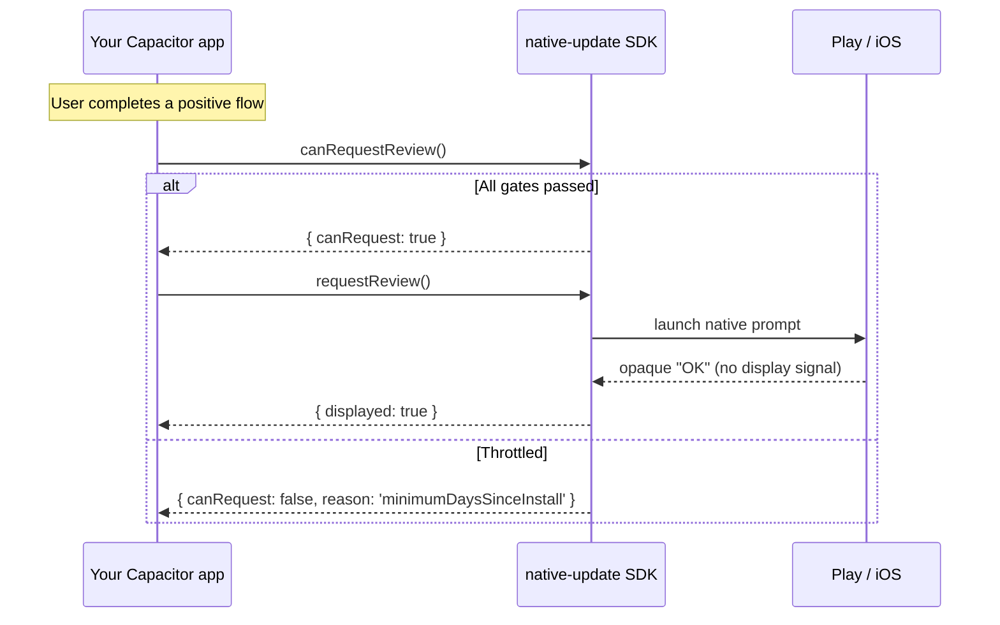

# App Review — Overview

**The App Review API of `native-update` shows the native review prompt — Google Play's In-App Review on Android, `SKStoreReviewController` on iOS — at the right moment, with sensible default throttling on top of the platform-managed quotas.** It is the smallest of the four feature areas (just two methods) but the most consequential to get right: a badly-timed prompt is wasted forever because both stores cap how often you can ask.

This page is the mental model. Follow the linked pages for the full reference:

- [Methods](./methods) — `requestReview()` + `canRequestReview()`
- [Config](./config) — `AppReviewConfig` field-by-field

## When to use App Review

| You want to… | App Review fits? | Notes |
|---|---|---|
| Ask the user to rate your app inside the app | ✅ Yes | The textbook use case. Fully native; no browser detour. |
| Send the user to write a review on the store page | ⚠️ Sometimes | Set `webReviewUrl` in [config](./config) for a fallback when the in-app prompt is unavailable. |
| Ask for a 5-star rating at app launch | ❌ No | Both stores penalise apps that ask too early. The defaults (7 days install, 3 launches) are deliberate. |
| Ask after every update | ❌ No | Apple caps prompts at **3 per 365 days** per user. Don't burn them. |
| Prompt only your "delighted" users | ✅ Yes | Use `customTriggers` and gate `requestReview()` behind your own happiness signal (NPS ≥ 9, completed onboarding, etc.). |

## Platform behaviour matrix

| Aspect | Android (Play In-App Review) | iOS (`SKStoreReviewController`) |
|---|---|---|
| Native prompt UI | Yes (overlay sheet inside your app) | Yes (modal sheet inside your app) |
| Platform-enforced rate limit | Multi-day quota (Google does not publish exact numbers) | **3 prompts per 365-day rolling window per user** |
| Whether the prompt actually displayed | **Not knowable** — Play's API never tells you whether the user saw it | Same — Apple's API doesn't surface "did it show?" either |
| Test in dev | Internal app sharing build with `setRealtimeFakeReview` | TestFlight or simulator (always shows in development) |
| Web fallback | Open `webReviewUrl` in a new tab | Open `webReviewUrl` in a new tab |

The "did it show?" gap is the most common source of confusion. Both platforms intentionally hide whether the prompt was actually displayed so developers cannot retry until they get a "yes". The plugin returns [`ReviewResult.displayed`](./methods#reviewresult) as a **best-effort** signal — `true` means the API returned without throwing, not that the user definitely saw a sheet.

## Apple's 3-per-365 rule

`SKStoreReviewController.requestReview` is throttled by iOS itself: a single user sees at most **3 review prompts per app per 365-day rolling window**. Once you've called it 3 times in a year, further calls are silently no-ops until a prompt ages out. There is no API to detect this — your code has no way to know "the user saw it" or "iOS threw it away".

The implication: **never call `requestReview()` reflexively**. Build a real user-happiness signal (purchase completed, level beaten, NPS positive, onboarding complete) and call `requestReview()` only after that signal fires.

## Default throttling on top

Even with platform-enforced caps, the plugin layers its own throttling so you do not need to write it yourself. Defaults — overridable via [config](./config):

| Throttle | Default | Rationale |
|---|---|---|
| `minimumDaysSinceInstall` | `7` | Apple recommends not prompting within the first week of install. |
| `minimumDaysSinceLastPrompt` | `90` | Approximates Apple's quarter-cap; safe even if the iOS API silently ignored a recent call. |
| `minimumLaunchCount` | `3` | Filter out users who installed and immediately bounced. |

[`canRequestReview()`](./methods#canrequestreview) returns `false` if any of these are not met — call it before `requestReview()` to avoid wasted calls.

## Mental model

## What every App Review flow needs

1. **A real user-happiness trigger.** Do not call on app launch, route change, or random timer. Call after a moment the user is likely happy: payment success, level cleared, sync finished, NPS-9 answer.
2. **`canRequestReview()` first.** Cheap check; respects all configured throttles. Skip the native call if it returns `false`.
3. **A web fallback (`webReviewUrl`).** For platforms / scenarios where the in-app prompt is not available (web, kiosk apps, devices without Play Services).

## Frequently asked questions

### How do I test it in development?

**Android**: Build with internal app sharing and use Play Console's "test" review flow. The Play emulator behaviour is unreliable. **iOS**: `SKStoreReviewController.requestReview` always displays in development and TestFlight builds; in production it respects the 3-per-365 cap. Set `debugMode: true` in [config](./config) to bypass the plugin's own throttles during development.

### Why isn't the prompt showing on my device?

Most common reasons:
1. You called it within 7 days of install (default `minimumDaysSinceInstall`).
2. Apple's silent 3-per-365 quota is exhausted on this device.
3. Play Services not installed (Android emulator without GMS, Huawei, F-Droid).
4. The user has explicitly disabled in-app review in their device settings.

The plugin returns `displayed: true` when the call succeeds, but it cannot detect cases 2–4 — neither store exposes a "did it actually show?" signal.

### Can I show a custom in-app rating UI before the native prompt?

Yes — and many apps should. Build your own thumbs-up / thumbs-down or NPS UI; only call `requestReview()` after a positive answer. This filters out unhappy users and conserves your store quota for real reviews.

### Does this affect my App Store / Play Store listing review count?

The native prompt is the same one that posts a review to the store listing. A prompt → a 5-star tap → a review on your listing. That's the whole point.

### What's the relationship to the App Update API?

They're independent. App Review prompts the user to **rate** the current binary. App Update prompts the user to **update** to a newer binary. Both can fire in the same session if appropriate; they share no state.

### Can I localise the prompt?

The native prompt UI is localised by the OS based on the device's primary language — you do not need to provide translations.

---

Reference pages by <a href="https://aoneahsan.com">Ahsan Mahmood</a>. Source of truth: <code>src/definitions.ts</code> in the plugin repo.

