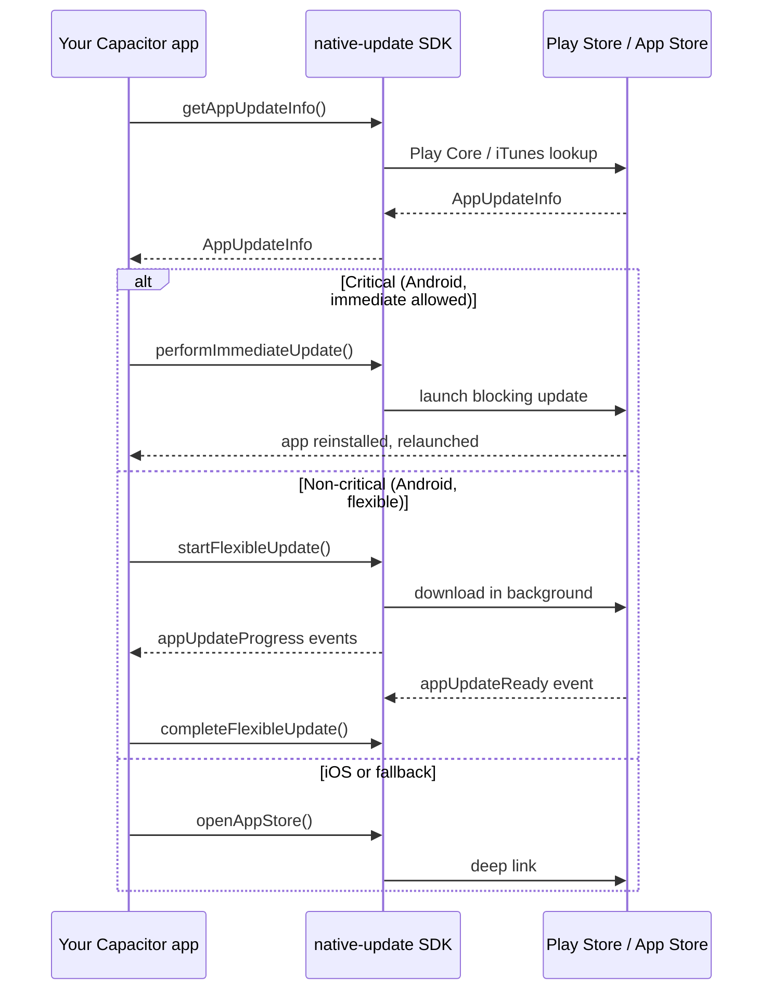

# App Update — Overview

**The App Update API of `native-update` wraps Google Play In-App Updates and the iOS App Store version check behind one cross-platform interface, letting your Capacitor app prompt users to update the App Store / Play Store binary from inside the app — without sending them to the store and back.** It is the second of four feature areas in the plugin (alongside [Live Update](../live-update/overview), App Review, and Background Updates) and complements OTA updates: when a fix needs native-code changes, you cannot ship it via Live Update; you ship a new binary and use App Update to nudge users onto it.

This page is the mental model. Follow the linked pages for the full reference:

- [Methods](./methods) — all 5 methods with TypeScript signatures
- [Types](./types) — `AppUpdateInfo`, `OpenAppStoreOptions`
- [Events](./events) — 7 lifecycle events
- [Config](./config) — `AppUpdateConfig` field-by-field

## When to use App Update

| You want to… | App Update fits? | Notes |
|---|---|---|
| Force users onto a critical native-code fix | ✅ Yes | Use `performImmediateUpdate()` (Android) and the `mandatory` flag in `AppUpdateInfo`. |
| Let users download a non-critical update in the background | ✅ Yes (Android only) | Use `startFlexibleUpdate()`. |
| Send users to the store page | ✅ Yes (cross-platform) | `openAppStore()` works everywhere. |
| Update only JavaScript / web assets | ❌ No | Use [Live Update](../live-update/overview) for that. |
| Push the update file yourself | ❌ No | App Update only triggers store-managed update flows. |

## Platform behaviour matrix

The two stores expose very different APIs. The plugin gives you one interface; what each method does on each platform is summarised below.

| Method | Android (Play Core) | iOS (App Store) | Web |
|---|---|---|---|
| `getAppUpdateInfo()` | Calls `AppUpdateManager.getAppUpdateInfo()`. Returns version, priority, and what flows are allowed. | Hits the iTunes lookup API for the binary's bundle ID. Returns version + store URL. | Fetches a server-defined JSON if you configured `serverUrl`. Otherwise returns "no update". |
| `performImmediateUpdate()` | Triggers Play's full-screen blocking update flow. | **Not supported.** Throws `PLATFORM_NOT_SUPPORTED`. Apple has no equivalent API. | **Not supported.** |
| `startFlexibleUpdate()` | Triggers Play's flexible (background download + foreground prompt) flow. | **Not supported.** Throws `PLATFORM_NOT_SUPPORTED`. | **Not supported.** |
| `completeFlexibleUpdate()` | Reloads the app to apply a flexible update that finished downloading. | **Not supported.** | **Not supported.** |
| `openAppStore()` | Opens the Play Store deep link for the configured `packageName`. | Opens the App Store deep link for the configured `appStoreId`. | Opens the web App Store / Play Store page in a new tab. |

In practice, your "we have a critical native fix" flow looks like:

```typescript
const info = await NativeUpdate.getAppUpdateInfo();
if (!info.updateAvailable) return;

if (info.immediateUpdateAllowed && Capacitor.getPlatform() === 'android') {
  await NativeUpdate.performImmediateUpdate();
} else {
  // iOS, web, or Android device that opted out of in-app updates
  await NativeUpdate.openAppStore();
}
```

## Update priorities (Android)

Play In-App Updates exposes a 0–5 priority for each release. Higher means more urgent. The plugin returns this verbatim in `AppUpdateInfo.updatePriority`. Your code chooses the UI based on the value:

| Priority | Typical use | Recommended UI |
|---|---|---|
| 0 | No urgency | Skip the prompt entirely until the next release. |
| 1–2 | Improvements, minor fixes | Soft banner; user can dismiss. |
| 3 | Important fixes | Modal prompt; user can defer once. |
| 4 | Critical fixes | Modal prompt with no defer; flexible update. |
| 5 | Security / data-integrity | `performImmediateUpdate()` — block the app until updated. |

Set the priority in your Play Console release flow or via the [Play Developer API](https://developers.google.com/android-publisher/api-ref/edits/tracks#resource). iOS has no equivalent; emulate priority by reading `clientVersionStalenessDays` and your own backend's "minimumVersion" value.

## Mental model



## What every App Update flow needs

1. **`appStoreId` and `packageName` configured.** Set both in [config](./config) so `openAppStore()` works on both platforms regardless of which store the device targets.
2. **A `minimumVersion` source of truth.** Either via Play priority (Android-only) or your own server-side config (cross-platform). The plugin doesn't ship a server-side version-gating service — that's the job of your backend or a feature-flag system.
3. **A fallback to `openAppStore()`.** Immediate / flexible updates are Android-only. On iOS you always end up sending users to the App Store page — design your UI for that path first.

## Frequently asked questions

### Why doesn't iOS support immediate / flexible updates?

Apple has not shipped an equivalent of Play In-App Updates as of iOS 18 / Xcode 16 (the current versions at the time of writing). The closest mechanism is the App Store version check — fetch the binary's metadata, compare versions, deep-link to the store. The plugin gives you that on iOS via `getAppUpdateInfo()` + `openAppStore()`.

### What's the difference between immediate and flexible update on Android?

**Immediate** is a full-screen, blocking flow — the app is unusable until the user accepts the update or cancels (which kills the app). Best for security-critical fixes. **Flexible** downloads in the background while the user keeps using the app; when the download finishes, you prompt for a quick restart via `completeFlexibleUpdate()`. Best for non-critical updates.

### Can I detect if the user has Play Store installed?

`getAppUpdateInfo()` will return `updateAvailable: false` and `flexibleUpdateAllowed: false` / `immediateUpdateAllowed: false` on devices without Play (Huawei without GMS, F-Droid installs, etc.). Always check those flags before triggering an update flow.

### Does this work on tvOS, watchOS, or wearOS?

No. The plugin targets phones and tablets (iOS, iPadOS, Android phone/tablet form factors).

### How do I test in-app updates without publishing to production?

Google requires the test track build's version code to be **lower** than the production build for `getAppUpdateInfo()` to report an update. Use the [Play Console internal app sharing](https://support.google.com/googleplay/android-developer/answer/9844679) flow plus a test version below your current production version. Apple has no test path — you can mock `getAppUpdateInfo()` via your dev backend.

### Do these flows count toward Apple's app-review prompt limit?

No. App Update prompts and App Review prompts are independent. See [App Review — Overview](../app-review/overview) for review throttling.

---

<div className="nu-author-card">
Reference pages by <a href="https://aoneahsan.com">Ahsan Mahmood</a>. Source of truth: <code>src/definitions.ts</code> in the plugin repo. Spot a discrepancy? <a href="https://github.com/aoneahsan/native-update-docs/issues">Open an issue</a>.
</div>
