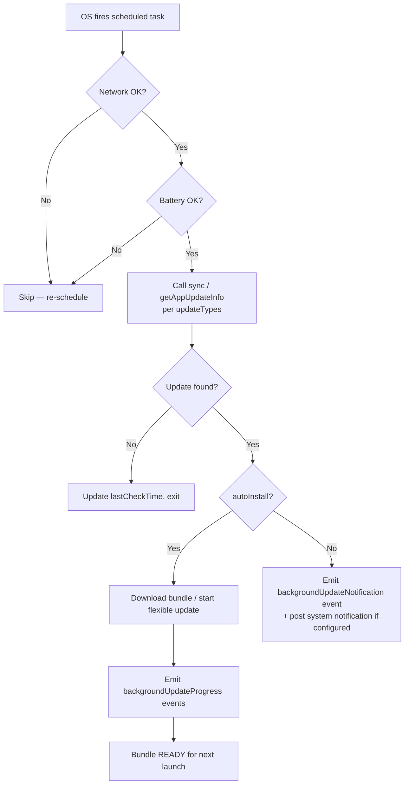

# Background Update — Overview

**The Background Update API of `native-update` runs silent update checks while your Capacitor app is in the background or closed, using Android `WorkManager` and iOS `BGTaskScheduler` under the hood, with optional native notifications when an update is found or installed.** It is the third of four feature areas in the plugin — it composes [Live Update](../live-update/overview) and [App Update](../app-update/overview) into a single scheduled job that respects battery, network, and OS-side scheduling constraints.

This page is the mental model. Follow the linked pages for the full reference:

- [Methods](./methods) — all 8 methods with TypeScript signatures
- [Config](./config) — `BackgroundUpdateConfig` and `NotificationPreferences` field-by-field
- [Events](./events) — `backgroundUpdateProgress`, `backgroundUpdateNotification`

## When to use Background Update

| You want to… | Background Update fits? | Notes |
|---|---|---|
| Check for updates on a schedule even when the app is closed | ✅ Yes | The textbook use case. WorkManager / BGTaskScheduler handle the OS scheduling. |
| Auto-download updates over Wi-Fi to be ready when the user opens the app | ✅ Yes | Set `autoInstall: true` and `requireWifi: true`. |
| Notify the user with a native push-style notification when an update is ready | ✅ Yes | Configure `notificationPreferences`; request `POST_NOTIFICATIONS` on Android 13+. |
| Run a check every 30 seconds | ❌ No | Both OSes coalesce background tasks. Minimum effective interval is ~15 minutes on Android, ~hours on iOS — the OS decides. |
| Guarantee an update lands by a specific time | ❌ No | Background scheduling is best-effort. Use [`sync()`](../live-update/methods#syncoptions) on app launch as a backstop. |

## Platform behaviour matrix

| Aspect | Android | iOS | Web |
|---|---|---|---|
| Underlying primitive | `WorkManager` (`PeriodicWorkRequest`) | `BGTaskScheduler` (`BGAppRefreshTask` + `BGProcessingTask`) | `setInterval` while page is visible only |
| Minimum effective interval | 15 minutes | "A few hours" — OS decides | Whatever you set, but only when the tab is active |
| Wi-Fi gating | `NetworkType.UNMETERED` constraint | OS coalesces with other tasks; Wi-Fi preference passed as a hint | Cannot detect connection metering reliably |
| Battery gating | `requiresBatteryNotLow` constraint | OS only schedules during opportunistic windows | N/A |
| Survives app force-quit | Yes (until user disables battery optimisations) | No (iOS pauses background tasks for force-quit apps) | No |
| Notification permission | `POST_NOTIFICATIONS` (Android 13+) required | iOS notification permission required | Browser Notification API |

The numbers above are intentional ranges, not specs — both stores deliberately leave themselves room to back off background work when the device is constrained. Treat your `checkInterval` as a request, not a guarantee.

## What a background check does

When the OS fires the scheduled task, the SDK runs this sequence:



What the OS gates control:

- **`requireWifi`** maps to `NetworkType.UNMETERED` on Android and a Wi-Fi preference on iOS.
- **`minimumBatteryLevel`** is checked in-process on both platforms — the OS does not enforce it natively, but the SDK aborts the task if the threshold is not met.
- **`respectBatteryOptimization`** (Android only) tells WorkManager to honour Doze and App Standby. Defaults to `true`. Setting to `false` requires the `REQUEST_IGNORE_BATTERY_OPTIMIZATIONS` permission and a user prompt — Play Store generally rejects apps that ask for this without strong justification.

## What every Background Update flow needs

1. **An entry-point call to `enableBackgroundUpdates()`** at app boot. The SDK persists the config; you only call this once per `appId`.
2. **Realistic interval expectations.** Even with `checkInterval: 900` (15 min) Android may run the task every 30+ minutes; iOS may run it every few hours.
3. **A foreground backstop.** Always also call [`sync()`](../live-update/methods#syncoptions) on app resume / launch — that catches users whose background updates have not run recently.
4. **Notification permission handling.** Call [`requestNotificationPermissions()`](./methods#requestnotificationpermissions) before relying on native notifications, and degrade gracefully if denied.

## Sample wiring

```typescript
import { NativeUpdate, BackgroundUpdateType, NotificationPriority } from 'native-update';

await NativeUpdate.requestNotificationPermissions();

await NativeUpdate.enableBackgroundUpdates({
  enabled: true,
  checkInterval: 21_600,                       // request 6h; OS decides actual cadence
  updateTypes: [BackgroundUpdateType.LIVE_UPDATE, BackgroundUpdateType.APP_UPDATE],
  autoInstall: true,
  respectBatteryOptimization: true,
  allowMeteredConnection: false,
  minimumBatteryLevel: 20,
  requireWifi: true,
  maxRetries: 3,
  retryDelay: 60_000,
  taskIdentifier: 'com.yourcompany.yourapp.background-update',
  notificationPreferences: {
    title: 'Update available',
    description: 'A new version of YourApp is ready to install.',
    soundEnabled: false,
    priority: NotificationPriority.DEFAULT,
    showActions: true,
    actionLabels: { updateNow: 'Restart now', updateLater: 'Later', dismiss: 'Dismiss' },
  },
});
```

## Frequently asked questions

### How often does the background task actually run?

On Android with default constraints, expect **every 30 minutes to 4 hours** depending on Doze, charging state, and recent device usage. On iOS, expect **once every few hours, typically when the device is on Wi-Fi and charging**. The `checkInterval` value is a *target* — the OS decides actual cadence. Both platforms coalesce background tasks across apps to save battery.

### Can I run an immediate background check?

Yes — call [`triggerBackgroundCheck()`](./methods#triggerbackgroundcheck). It runs the same sequence but in the foreground (no OS scheduling), so it always executes immediately. Use this in pull-to-refresh UIs or in a "Check for updates" settings button.

### Do I need notification permission?

Only if you set `notificationPreferences` and want native notifications. The check itself runs without notification permission. On Android 13+ you must request `POST_NOTIFICATIONS` at runtime; on older Android versions the permission is granted at install time. iOS always requires runtime permission.

### Will background updates drain the battery?

No — both OSes throttle background tasks specifically to prevent that. The plugin layers additional `minimumBatteryLevel` and `requireWifi` gates on top so users on low battery or cellular never see a background download.

### What happens if the user force-quits my app?

On iOS, force-quit pauses all background scheduling for that app until the user opens it again — this is an Apple-enforced behaviour, not a plugin limitation. On Android, force-quit does **not** stop WorkManager (unless the user also disables battery optimisations for your app), so background checks continue.

### Can I do work other than update checks in this background task?

Not via this API. The plugin's background task is single-purpose: check for updates of the types in `updateTypes`. If you need general background work, use a Capacitor background plugin (`@capacitor/background-task`, `@capacitor-community/background-fetch`, or similar) and trigger update checks from inside that.

---

<div className="nu-author-card">
Reference pages by <a href="https://aoneahsan.com">Ahsan Mahmood</a>. Source of truth: <code>src/definitions.ts</code> in the plugin repo. Spot a discrepancy? <a href="https://github.com/aoneahsan/native-update-docs/issues">Open an issue</a>.
</div>
