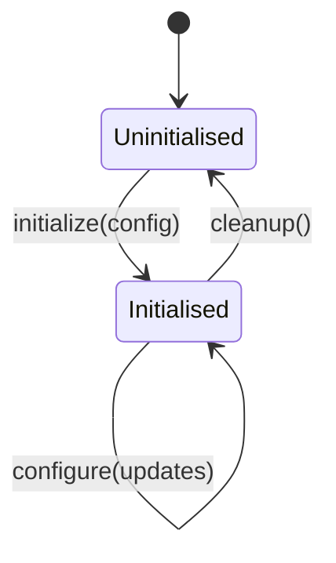

# Core — Lifecycle

Five methods on `NativeUpdatePlugin` manage the lifecycle of the plugin itself. Every other method on every other feature area depends on `initialize()` having resolved.

```typescript
import { NativeUpdate } from 'native-update';
import type { PluginInitConfig, UpdateConfig } from 'native-update';
```

| Method | When you call it |
|---|---|
| [`initialize(config)`](#initialize) | Once at app boot, before any other plugin call |
| [`isInitialized()`](#isinitialized) | Defensive checks; tests; debug screens |
| [`configure(config)`](#configure) | Update non-startup config at runtime (channel switch, server URL change) |
| [`reset()`](#reset) | Roll back live-update state to "binary default" |
| [`cleanup()`](#cleanup) | Release resources before app shutdown / on logout |

---

## `initialize(config)` {#initialize}

```typescript
initialize(config: PluginInitConfig): Promise<void>
```

The first call. Sets up storage, validates config, registers OS task identifiers (if background updates are enabled in the config), and resolves the promise once the plugin is ready.

**Parameters** — see [Core — Config](./config) for every field on `PluginInitConfig`.

**Throws** `INVALID_CONFIG` (required field missing or out of range), `STORAGE_ERROR` (cannot access app sandbox).

**Idempotency** — safe to call multiple times with the same config. Calling with a *different* config replaces the prior configuration entirely.

```typescript
import { NativeUpdate, UpdateStrategy, ChecksumAlgorithm } from 'native-update';

await NativeUpdate.initialize({
  appId: 'com.yourcompany.yourapp',
  serverUrl: 'https://updates.yourdomain.com',
  apiKey: import.meta.env.VITE_NATIVE_UPDATE_API_KEY,
  channel: 'production',
  publicKey: import.meta.env.VITE_NATIVE_UPDATE_PUBLIC_KEY,
  requireSignature: true,
  checksumAlgorithm: ChecksumAlgorithm.SHA256,
  updateStrategy: UpdateStrategy.BACKGROUND,
  autoCheck: true,
  checkInterval: 3_600_000,                  // ms — note: PluginInitConfig is in ms
  enableLogging: import.meta.env.DEV,
});
```

:::warning Where to call it
Call `initialize()` from your app entry file (`src/main.ts`, `src/main.tsx`, `App.vue`, etc.) *before* you mount the UI. Calling from a deeply-nested component leaks plugin state to whichever component happens to render first.
:::

---

## `isInitialized()` {#isinitialized}

```typescript
isInitialized(): boolean
```

Synchronous check. Returns `true` once `initialize()` has resolved. Useful in defensive code and in tests.

```typescript
if (!NativeUpdate.isInitialized()) {
  console.warn('[native-update] plugin not initialised yet');
  return;
}
await NativeUpdate.sync();
```

This is the only synchronous method on the plugin; every other method returns a promise.

---

## `configure(config)` {#configure}

```typescript
configure(config: UpdateConfig | { config: PluginInitConfig }): Promise<void>
```

Replace runtime configuration without re-initialising. Use this when:

- The user switches channels in your settings UI.
- An A/B test flips the strategy from `BACKGROUND` to `IMMEDIATE`.
- You receive a new public key from the server for key rotation.

The two argument shapes accommodate two call styles:

```typescript
// Style A — pass a partial UpdateConfig directly:
await NativeUpdate.configure({ liveUpdate: { channel: 'beta' } });

// Style B — pass a full PluginInitConfig wrapped in { config: ... }:
await NativeUpdate.configure({ config: { ...everything, channel: 'beta' } });
```

Style A is the common one. Style B exists for parity with `initialize()` and is convenient when you keep your plugin config in a single object that you spread into both calls.

For one-off per-call overrides (channel, update mode), the dedicated methods on `LiveUpdatePlugin` ([`setChannel`](../live-update/methods#setchannel), [`setUpdateUrl`](../live-update/methods#setupdateurl)) are simpler.

---

## `reset()` {#reset}

```typescript
reset(): Promise<void>
```

Two distinct meanings depending on context:

1. **On `LiveUpdatePlugin`** — rolls the device back to the binary-shipped bundle (the one that came with the App Store / Play Store install). All downloaded OTA bundles are deleted; the next launch boots from the original web assets. Use as a panic button for a corrupted bundle state.
2. **On the core `NativeUpdatePlugin`** — clears persisted plugin state (last-check time, retry counters, cached bundle metadata) but does *not* delete bundles. Use for "reset to factory defaults" UI in your settings.

The two `reset()` methods share the name for ergonomics on the combined `NativeUpdatePlugin` interface — calling `NativeUpdate.reset()` invokes the live-update reset (the more common operation). Power users who want the core-only reset can access `pluginManager.reset()` via the [`PluginManager`](#plugin-manager-power-user-export) export below.

```typescript
// Roll back to the binary's original bundle:
await NativeUpdate.reset();
```

---

## `cleanup()` {#cleanup}

```typescript
cleanup(): Promise<void>
```

Releases resources held by the plugin — closes file handles, cancels in-flight downloads, removes event listeners registered internally, deregisters the background task. Call:

- Before app shutdown (typically wired to a `beforeunload` handler on web; rarely needed on mobile).
- On user logout if you want to fully tear down the plugin between sessions.
- In test teardown.

```typescript
afterEach(async () => {
  await NativeUpdate.cleanup();
});
```

`cleanup()` is *destructive* — after it resolves, `isInitialized()` returns `false` and you must `initialize()` again before using any other method.

---

## Calling order



Practical rules:

- Never call any feature method before `initialize()` resolves — you get `NOT_CONFIGURED`.
- `initialize()` is idempotent; safe to call from multiple bootstrap paths.
- `cleanup()` requires re-`initialize()` before next use.

---

## Plugin manager (power-user export) {#plugin-manager-power-user-export}

For advanced scenarios (custom test harnesses, embedding the SDK in another framework's lifecycle), the plugin exports `PluginManager` directly:

```typescript
import { PluginManager } from 'native-update';
```

`PluginManager` exposes the lower-level lifecycle hooks the friendly facade above wraps. Most apps never need it — it is documented for completeness, not because typical apps should reach for it.

---

<div className="nu-author-card">
Lifecycle reference verified against <code>src/definitions.ts</code> in the plugin repo as of <strong>2026-05-11</strong>. Documented by <a href="https://aoneahsan.com">Ahsan Mahmood</a>.
</div>
