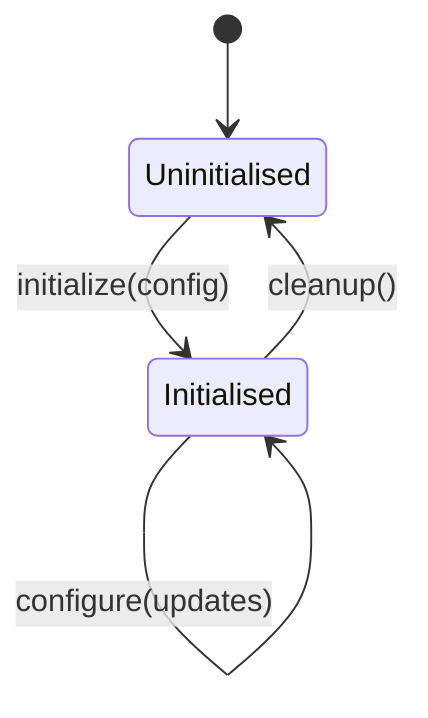

# Core — Lifecycle

Five methods on `NativeUpdatePlugin` manage the lifecycle of the plugin itself. Every other method on every other feature area depends on `initialize()` having resolved.

```typescript
import { NativeUpdate } from 'native-update';
import type { PluginInitConfig, UpdateConfig } from 'native-update';
```

| Method | When you call it |
|---|---|
| [`initialize(config)`](#initialize) | Once at app boot, before any other plugin call |
| [`isInitialized()`](#isinitialized) | Defensive checks; tests; debug screens |
| [`configure(config)`](#configure) | Alternative first-time configuration shape; locked after initialization |
| [`reset()`](#reset) | Clear downloaded bundles and configuration, then allow reinitialization |
| [`cleanup()`](#cleanup) | Release resources before app shutdown / on logout |

---

## `initialize(config)` {#initialize}

```typescript
initialize(config: PluginInitConfig): Promise<void>
```

The first call. Sets up storage, validates config, registers OS task identifiers (if background updates are enabled in the config), and resolves the promise once the plugin is ready.

**Parameters** — see [Core — Config](./config) for every field on `PluginInitConfig`.

**Throws** `INVALID_CONFIG` (required field missing or out of range), `STORAGE_ERROR` (cannot access app sandbox).

**Idempotency** — subsequent calls are ignored while initialized, even when values differ. To change locked
configuration, call `reset()` and then `initialize()` again.

```typescript
import { NativeUpdate, UpdateStrategy, ChecksumAlgorithm } from 'native-update';

await NativeUpdate.initialize({
  appId: 'com.yourcompany.yourapp',
  serverUrl: 'https://updates.yourdomain.com',
  apiKey: import.meta.env.VITE_NATIVE_UPDATE_API_KEY,
  channel: 'production',
  publicKey: import.meta.env.VITE_NATIVE_UPDATE_PUBLIC_KEY,
  requireSignature: true,
  checksumAlgorithm: ChecksumAlgorithm.SHA256,
  updateStrategy: UpdateStrategy.BACKGROUND,
  autoCheck: true,
  checkInterval: 3_600_000,                  // ms — note: PluginInitConfig is in ms
  enableLogging: import.meta.env.DEV,
});
```

:::warning Where to call it
Call `initialize()` from your app entry file (`src/main.ts`, `src/main.tsx`, `App.vue`, etc.) *before* you mount the UI. Calling from a deeply-nested component leaks plugin state to whichever component happens to render first.
:::

---

## `isInitialized()` {#isinitialized}

```typescript
isInitialized(): Promise<boolean>
```

Asynchronous check. Resolves `true` once `initialize()` has completed. Useful in defensive code and tests.

```typescript
if (!(await NativeUpdate.isInitialized())) {
  console.warn('[native-update] plugin not initialised yet');
  return;
}
await NativeUpdate.sync();
```

## `configure(config)` {#configure}

```typescript
configure(config: UpdateConfig | { config: PluginInitConfig }): Promise<void>
```

Configure and initialize the plugin using either accepted argument shape. This method is only valid before
initialization; afterward it rejects with `INVALID_CONFIG` because update-server and trust settings are
immutable for the session.

```typescript
// Style A — pass a partial UpdateConfig directly:
await NativeUpdate.configure({ liveUpdate: { channel: 'beta' } });

// Style B — pass a full PluginInitConfig wrapped in { config: ... }:
await NativeUpdate.configure({ config: { ...everything, channel: 'beta' } });
```

Prefer `initialize()` for new code. `setChannel()` remains the supported runtime channel preference. To
change server URL, API key, public key, allowed hosts, or signature policy, call `reset()` and initialize
again. `setUpdateUrl()` is a deprecated no-op.

---

## `reset()` {#reset}

```typescript
reset(): Promise<void>
```

Cancels active downloads, deletes downloaded OTA bundles and cached versions, removes listeners, restores
default configuration, and marks the plugin uninitialized. The app returns to its binary-shipped web bundle.
Call `initialize()` afterward before using update methods again.

```typescript
// Roll back to the binary's original bundle:
await NativeUpdate.reset();
```

---

## `cleanup()` {#cleanup}

```typescript
cleanup(): Promise<void>
```

Releases resources held by the plugin — closes file handles, cancels in-flight downloads, removes event listeners registered internally, deregisters the background task. Call:

- Before app shutdown (typically wired to a `beforeunload` handler on web; rarely needed on mobile).
- On user logout if you want to fully tear down the plugin between sessions.
- In test teardown.

```typescript
afterEach(async () => {
  await NativeUpdate.cleanup();
});
```

`cleanup()` is *destructive* — after it resolves, `isInitialized()` returns `false` and you must `initialize()` again before using any other method.

---

## Calling order


```mermaid
stateDiagram-v2
    [*] --> Uninitialised
    Uninitialised --> Initialised: initialize(config)
    Initialised --> Initialised: any other plugin call
    Initialised --> Initialised: configure(updates)
    Initialised --> Uninitialised: cleanup()
```

Practical rules:

- Never call any feature method before `initialize()` resolves — you get `NOT_CONFIGURED`.
- `initialize()` is idempotent; safe to call from multiple bootstrap paths.
- `cleanup()` requires re-`initialize()` before next use.

---

## Plugin manager (power-user export) {#plugin-manager-power-user-export}

For advanced scenarios (custom test harnesses, embedding the SDK in another framework's lifecycle), the plugin exports `PluginManager` directly:

```typescript
import { PluginManager } from 'native-update';
```

`PluginManager` exposes the lower-level lifecycle hooks the friendly facade above wraps. Most apps never need it — it is documented for completeness, not because typical apps should reach for it.

---

<div className="nu-author-card">
Lifecycle reference verified against <code>src/definitions.ts</code> in the plugin repo as of <strong>2026-05-11</strong>. Documented by <a href="https://aoneahsan.com">Ahsan Mahmood</a>.
</div>
