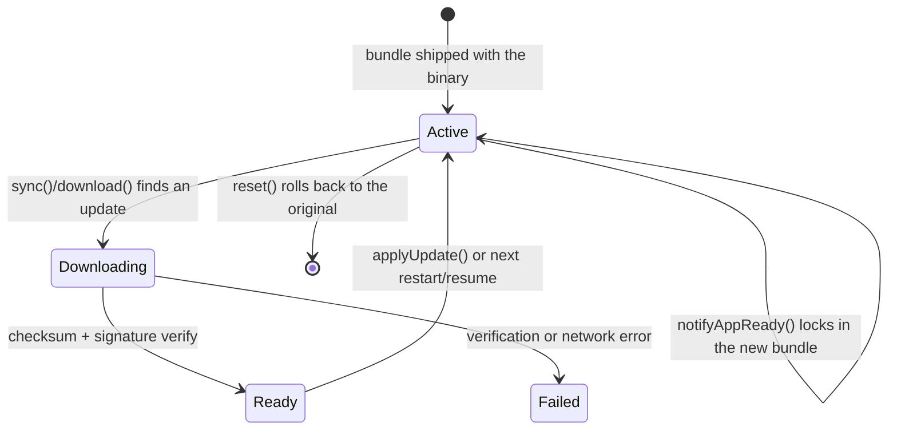

# Live Update — Overview

**The Live Update API of `native-update` ships JavaScript bundles to installed Capacitor apps over the air, replacing the bundled web assets at runtime without rebuilding or resubmitting the app.** It is one of four feature areas exposed by the plugin (alongside App Update, App Review, and Background Updates) and is the largest by surface area: 20 methods, 11 types, 5 enums, 2 events, and one config object.

Use this page to get the mental model. Follow the linked pages for the full reference:

- [Methods](./methods) — every public method with TypeScript signature, parameters, return value, errors, and examples
- [Types](./types) — `BundleInfo`, `SyncOptions`, `SyncResult`, `DownloadOptions`, and the rest
- [Enums](./enums) — `UpdateStrategy`, `UpdateMode`, `BundleStatus`, `SyncStatus`, `ChecksumAlgorithm`
- [Events](./events) — `downloadProgress`, `updateStateChanged`
- [Config](./config) — `LiveUpdateConfig` field-by-field

## When to use Live Update

| You want to… | Live Update fits? | Notes |
|---|---|---|
| Push a JS / CSS / asset hotfix without an App Store / Play Store submission | ✅ Yes | The textbook use case. |
| Push a critical security patch within hours, not days | ✅ Yes | Use `updateStrategy: 'IMMEDIATE'`. |
| A/B test new features by channel | ✅ Yes | Use channels (`production`, `staging`, `beta`, …) and `setChannel()`. |
| Stage a rollout to a percentage of users | ✅ Yes | Wire your backend's rollout response into the sync flow. |
| Prompt the user to update the App Store binary | ❌ No | That is the App Update API. |
| Replace native (Kotlin / Swift) code | ❌ No | Native code changes still require a store submission. |
| Update the app silently while the user is offline | ❌ No | Updates require an HTTP fetch. |

## The mental model

Every bundle on a device is in one of five states (formal definitions on the [Enums](./enums#bundlestatus) page). Methods either inspect the current state, advance it forward, or roll it back.

## The lifecycle in plain English

1. **App boots** with the bundle that shipped in the binary (or the most recently activated OTA bundle).
2. **`sync()` is called** — typically in a startup hook, on resume, or by a background worker. The plugin asks your update server "what's the latest version on this channel for this app?".
3. If an update is available, the plugin **downloads the bundle**, verifies its **checksum** (SHA-256 / SHA-512) and **signature** (RSA / ECDSA over the checksum), and stores it as `READY`.
4. The bundle is **applied** based on the configured `UpdateStrategy`:
   - `IMMEDIATE` — reload the web view now
   - `BACKGROUND` — apply on next resume
   - `MANUAL` — your code calls `applyUpdate()` explicitly
5. After a successful first render on the new bundle, **your code calls `notifyAppReady()`**. This is the "I did not crash before getting here" signal. If the app crashes or is killed before this call on the new bundle, the next launch automatically rolls back to the previous bundle.
6. **Rollback** (`reset()`) returns the device to the bundle that shipped with the App Store / Play Store binary. Channel switches, key rotations, or detected bundle corruption can also trigger automatic rollbacks.

## Method groupings

The 20 methods organise around six concerns:

| Group | Methods | What they do |
|---|---|---|
| **Sync & check** | `sync`, `getLatest`, `checkForUpdate` | Talk to the server, decide whether action is needed. |
| **Download** | `download`, `downloadUpdate`, `cancelDownload`, `cancelAllDownloads`, `isDownloading`, `getActiveDownloadCount` | Fetch the bundle bytes; inspect / cancel in-flight transfers. |
| **Apply & rollback** | `set`, `reload`, `applyUpdate`, `reset`, `notifyAppReady` | Activate a downloaded bundle; mark the new bundle healthy; revert. |
| **Inspect** | `current`, `list` | Read what is on the device. |
| **Configure** | `setChannel`, `setUpdateUrl` | Switch channel or override the server URL at runtime. |
| **Maintenance** | `delete`, `validateUpdate` | Garbage-collect old bundles; re-verify a stored bundle. |

## What every Live Update flow needs

Three things are non-negotiable in production:

1. **A signed bundle.** Set `requireSignature: true` in [config](./config) and configure `publicKey`. Unsigned bundles are useful in development only.
2. **`notifyAppReady()` after first meaningful render.** Without this, every update will roll back on the next launch. This is intentional and matches the same safety contract as CodePush, EAS Update, and Capacitor Live Updates.
3. **HTTPS for `serverUrl`.** Plain HTTP is rejected at startup. iOS App Transport Security would block the request anyway; the plugin gives you the same error on every platform for consistency.

## What it costs to use

Nothing on the SDK side. The npm package is MIT-licensed. You either:

- **Self-host the backend** — the reference Laravel + Nova implementation in this repo is also MIT, deployable to any PHP host. Setup guide ships in **Batch 6** of this docs site.
- **Use the hosted [Native Update SaaS](https://nativeupdate.aoneahsan.com)** — free tier covers small apps; paid tiers documented at the marketing site.

You do not pay per device check, per download, or per bundle, and there are no telemetry hooks that ship to a third-party.

## Frequently asked questions

### How big can a bundle be?

Default limit is conservative (`maxBundleSize` in [config](./config)). Apple imposes its own cellular-download cap (~200 MB per request without prompting the user); the plugin honours this on iOS regardless of `maxBundleSize`.

### Can I push native code via Live Update?

No. The plugin only swaps the web layer (JavaScript, HTML, CSS, fonts, images, JSON, and any other assets bundled with the web build). Apple [App Store Review Guideline 4.7](https://developer.apple.com/app-store/review/guidelines/#4.7) explicitly permits this for "scripts, code and interpreters" but only for code that runs in your app's web view. Trying to push compiled native code via OTA is a guideline violation and will get the app rejected.

### How does rollback decide what is "broken"?

If `notifyAppReady()` is not called within the first session on a new bundle, the next cold start treats the bundle as failed and reverts. You can also force a rollback from your server (Batch 6 covers the contract for this).

### Does it support delta updates?

Not in v3. A single bundle download is a full ZIP of the web build. Delta updates are tracked for a future major.

### What channels ship by default?

The SDK does not enforce a channel name list. Common conventions: `production`, `staging`, `beta`, `dev`. Backend resources usually allow free-form channel strings — inspect `BuildChannel` in the Nova admin to confirm what your backend allows.

### Can I update on emulators / simulators?

Set `allowEmulator: true` in the [config](./config). It is `false` by default to prevent accidental dev pushes from running on real devices.

---

Reference pages by <a href="https://aoneahsan.com">Ahsan Mahmood</a>. Source of truth: <code>src/definitions.ts</code> in the plugin repo. Spot a discrepancy? <a href="https://github.com/aoneahsan/native-update-docs/issues">Open an issue</a>.

